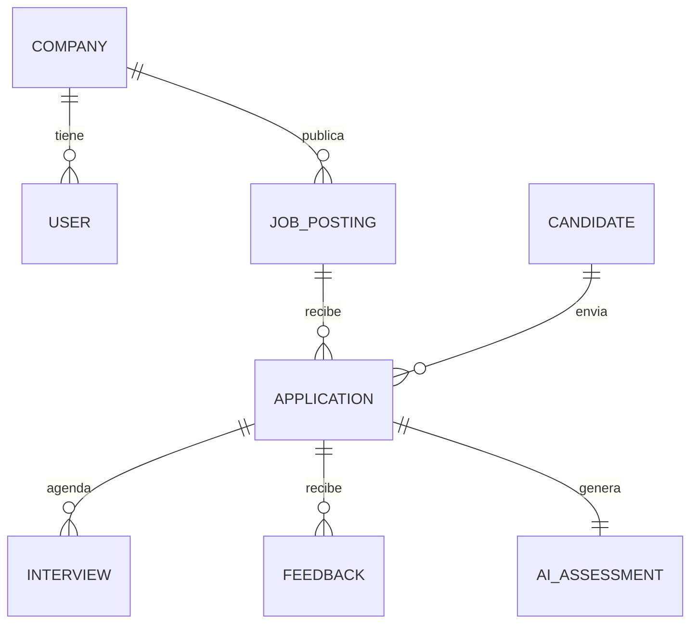
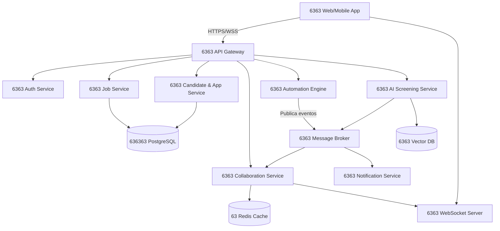
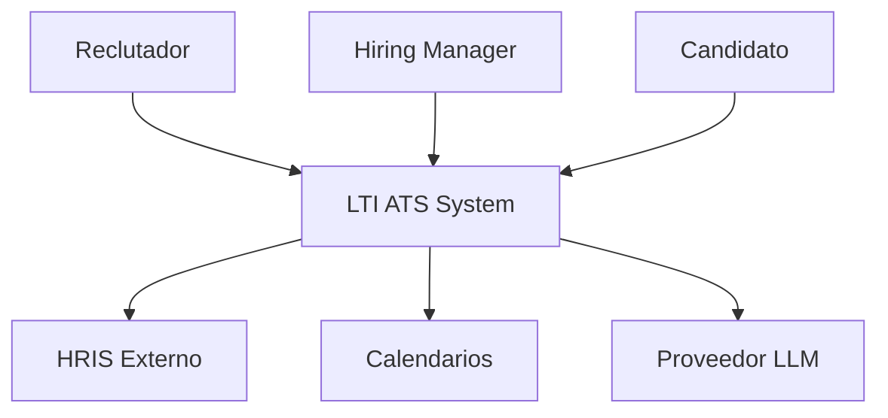
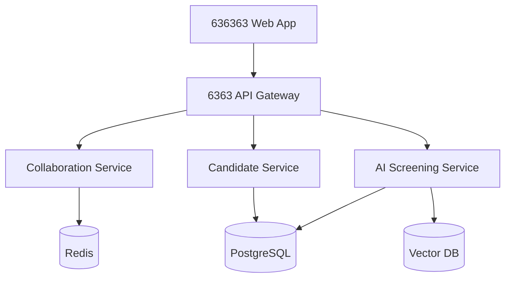
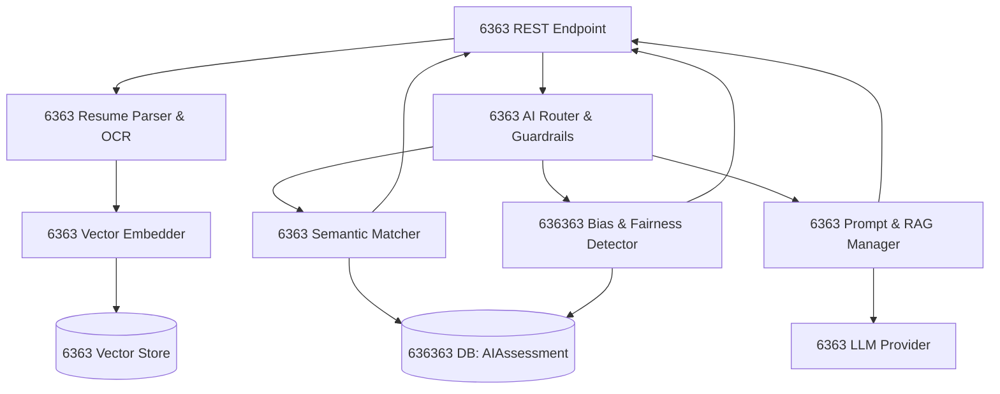

Aquí tienes los dos archivos solicitados. Puedes copiar el contenido y guardarlo exactamente con la estructura de carpetas indicada.

6363 `LTI-iniciales/`
195196196 `LTI-iniciales.md`
192196196 `prompts.md`

---

### 6363 Archivo 1: `LTI-iniciales.md`

```markdown
# 6363 LTI ATS - Documentación de Diseño Inicial (v1.0)

## 1. Descripción breve, valor añadido y ventajas competitivas

**LTI (Long-Term Intelligence)** es un Applicant Tracking System (ATS) de nueva generación diseñado para transformar la contratación en un proceso estratégico, colaborativo y potenciado por IA. 

A diferencia de los ATS tradicionales (que actúan como simples bases de datos de CVs), LTI funciona como un **copiloto activo** que automatiza tareas operativas, centraliza la comunicación entre HR y Hiring Managers, y ofrece insights predictivos en tiempo real.

### 6363 Valor Añadido
- **Eficiencia HR:** Reduce el *time-to-hire* en un ~35% y elimina tareas manuales de cribado y seguimiento.
- **Colaboración nativa:** Comentarios en línea, menciones, notas de voz y flujos de aprobación integrados directamente en el pipeline.
- **IA Explicable:** Puntuaciones y recomendaciones acompañadas de justificaciones transparentes, evitando sesgos algorítmicos.
- **Automatización No-Code:** Cualquier miembro de RRHH puede crear flujos de trabajo sin depender del equipo técnico.

### 6363 Ventajas Competitivas
1. **Motor de IA contextual** (no solo keyword matching, sino análisis semántico de competencias, proyectos y potencial).
2. **Arquitectura Event-Driven** que garantiza colaboración en tiempo real sin refresh ni latencia.
3. **Bias-Detection integrado** que alerta sobre patrones discriminatorios y sugiere lenguaje inclusivo en JDs.
4. **API-First & Marketplace nativo** para integraciones con HRIS, calendarios, herramientas de video y plataformas de evaluación.

---

## 2. Funciones principales

| Función | Descripción |
|---------|-------------|
| 6363 **Cribado Inteligente con IA** | Parseo automático de CVs, extracción de skills, matching semántico con la JD y generación de puntuaciones + entrevistas sugeridas. |
| 6363 **Pipeline Colaborativo** | Espacio compartido por candidato/vacante con hilos de comentarios, @menciones, votos, aprobación en 1 clic y notificaciones en tiempo real. |
| 6363 **Motor de Automatizaciones** | Sistema drag-and-drop para crear triggers (ej: `SI estado = "Entrevistado" ENTONCES enviar email + asignar tarea al manager + actualizar CRM`). |
| 6363 **Analytics & Equidad** | Dashboards con métricas de funnel, source effectiveness, diversity tracking y alertas de sesgo en decisiones humanas o algorítmicas. |
| 6363 **Gestión de Entrevistas Unificada** | Sincronización con Google/Outlook, booking links, plantillas de feedback estructurado y grabación/transcripción automática. |
| 6363 **Hub de Integraciones** | Conectores nativos para LinkedIn, Slack/Teams, Workday/BambooHR, Calendly, Zoom/Meet y APIs REST/Webhooks abiertas. |

---

## 3. Diagrama Lean Canvas

```markdown
| Problema | Segmentos de Clientes | Propuesta de Valor | Solución | Canales |
|----------|----------------------|-------------------|----------|---------|
| 7 ATS lentos y siloed<br>7 Cribado manual repetitivo<br>7 Falta de alineación HR-Managers<br>7 Sesgos inconscientes en contratación | 7 Startups & Scale-ups (50-1000 emp.)<br>7 Departamentos de RRHH modernos<br>7 Hiring Managers técnicos | ATS colaborativo + IA explicable que reduce time-to-hire un 35%, elimina fricciones y garantiza equidad. | 7 Copiloto de IA para screening<br>7 Pipeline en tiempo real<br>7 Automatizaciones no-code<br>7 Analytics de diversidad | 7 Venta directa B2B SaaS<br>7 Partnerships con consultoras RRHH<br>7 Freemium para startups<br>7 Marketplace de integraciones |

| Métricas Clave | Estructura de Costes | Fuentes de Ingresos | Ventajas Exclusivas | Alternativas |
|----------------|---------------------|---------------------|---------------------|--------------|
| 7 Time-to-hire<br>7 Tasa de adopción por manager<br>7 Reducción de sesgo medible<br>7 NPS > 60 | 7 Infraestructura cloud & GPU IA<br>7 Desarrollo de producto<br>7 Soporte & Customer Success<br>7 Cumplimiento GDPR/LOPDGDD | 7 Suscripción SaaS por usuario/mes<br>7 Tier Enterprise (SLA, SSO, on-prem)<br>7 Add-ons: IA avanzada, integraciones custom | 7 IA semántica + explicabilidad<br>7 Colaboración real-time nativa<br>7 Arquitectura event-driven<br>7 Transparencia algorítmica certificada | Greenhouse, Lever, Ashby, Workday Recruiting, spreadsheets + emails |
```

---

## 4. Casos de uso principales

### 6363 UC1: Publicar y gestionar una vacante
**Actor principal:** Reclutador / Talent Acquisition Specialist  
**Descripción:** El usuario crea una nueva vacatura, redacta la JD con asistencia de IA, define el pipeline de etapas, configura automatizaciones de publicación en boards y asigna revisores.  
**Flujo:** Crear JD 26 Asistencia IA 26 Configurar etapas 26 Publicar 26 Notificar stakeholders.

```mermaid
usecaseDiagram
  actor "Reclutador" as R
  package "LTI ATS" {
    usecase "UC1: Publicar y gestionar vacante" as UC1
    usecase "Redactar JD con IA" as UC1_1
    usecase "Configurar pipeline" as UC1_2
    usecase "Publicar en boards" as UC1_3
  }
  R --> UC1
  UC1 ..> UC1_1 : incluye
  UC1 ..> UC1_2 : incluye
  UC1 ..> UC1_3 : incluye
```

### 6363 UC2: Cribado y puntuación asistida por IA
**Actor principal:** Reclutador / Sistema IA  
**Descripción:** Los candidatos aplican o son importados. La IA parsea CVs, extrae competencias, compara semánticamente con la JD, genera un *match score* y sugiere preguntas de entrevista. El reclutador valida o ajusta manualmente.  
**Flujo:** Recepción CV 26 Parseo & Vectorización 26 Matching IA 26 Generación score 26 Revisión humana.

```mermaid
usecaseDiagram
  actor "Reclutador" as R
  actor "Sistema IA" as AI
  package "LTI ATS" {
    usecase "UC2: Cribado y puntuación IA" as UC2
    usecase "Parsear y extraer skills" as UC2_1
    usecase "Calcular match score" as UC2_2
    usecase "Generar preguntas entrevista" as UC2_3
  }
  AI --> UC2
  UC2 --> UC2_1
  UC2 --> UC2_2
  UC2 --> UC2_3
  UC2_2 ..> R : valida
```

### 6363 UC3: Colaboración y decisión conjunta con Hiring Manager
**Actor principal:** Reclutador & Hiring Manager  
**Descripción:** Ambos actores revisan candidatos, dejan feedback estructurado, debaten en hilos, votan y aprueban el pase a la siguiente etapa o la oferta final.  
**Flujo:** Notificación 26 Revisión 26 Feedback comentado 26 Votación 26 Decisión automatizada.

```mermaid
usecaseDiagram
  actor "Reclutador" as R
  actor "Hiring Manager" as HM
  package "LTI ATS" {
    usecase "UC3: Colaboración y decisión" as UC3
    usecase "Dejar feedback estructurado" as UC3_1
    usecase "Votar candidato" as UC3_2
    usecase "Aprobar pase de etapa" as UC3_3
  }
  R --> UC3
  HM --> UC3
  UC3 --> UC3_1
  UC3 --> UC3_2
  UC3 --> UC3_3
  UC3_2 ..> UC3_3 : requiere mayoría
```

---

## 5. Modelo de datos

### Entidades, atributos y relaciones

| Entidad | Atributos (nombre : tipo) |
|---------|---------------------------|
| `User` | id: UUID, name: string, email: string, role: enum, company_id: UUID, created_at: timestamp |
| `Company` | id: UUID, name: string, plan: enum, timezone: string, created_at: timestamp |
| `JobPosting` | id: UUID, company_id: UUID, title: string, description: text, status: enum, stages: JSON, created_by: UUID |
| `Candidate` | id: UUID, name: string, email: string, phone: string, resume_url: string, vector_embedding: array |
| `Application` | id: UUID, candidate_id: UUID, job_id: UUID, status: enum, score: float, applied_at: timestamp |
| `Interview` | id: UUID, application_id: UUID, interviewer_id: UUID, scheduled_at: timestamp, platform: enum, recording_url: string |
| `Feedback` | id: UUID, application_id: UUID, user_id: UUID, rating: int, comments: text, bias_flag: boolean, created_at: timestamp |
| `AIAssessment` | id: UUID, application_id: UUID, match_score: float, skills_extracted: JSON, justification: text, model_version: string |

**Relaciones principales:**
- `Company` 1:N `User`
- `Company` 1:N `JobPosting`
- `JobPosting` 1:N `Application`
- `Candidate` 1:N `Application`
- `Application` 1:N `Interview`
- `Application` 1:N `Feedback`
- `Application` 1:1 `AIAssessment`



---

## 6. Diseño de sistema a alto nivel

### 636363 Arquitectura explicada
LTI sigue una **arquitectura cloud-native, event-driven y basada en microservicios**:
- **Frontend:** SPA (React/Next.js) con WebSockets para colaboración en tiempo real.
- **API Gateway:** Enrutamiento, autenticación (OAuth2/OIDC), rate limiting y throttling.
- **Microservicios:** Desacoplados por dominio (`auth`, `jobs`, `candidates`, `collaboration`, `automation`, `ai-engine`).
- **Data Stores:** 
  - PostgreSQL (datos relacionales transaccionales)
  - Redis (caché, sesiones, cola de pub/sub para notificaciones)
  - Vector DB (Pinecone/Weaviate) para embeddings de CVs y JDs
  - Elasticsearch (búsqueda full-text y filtrado avanzado)
- **Message Broker:** Apache Kafka o RabbitMQ para eventos asíncronos (`application.created`, `feedback.posted`, `ai.score.ready`).
- **IA/ML:** Servicio externo o interno con LLMs fine-tuned, pipelines de RAG y guardrails de seguridad.
- **Seguridad & Cumplimiento:** Cifrado en tránsito/reposo, encriptación de PII, logs auditables, GDPR/LOPDGDD compliant.



---

## 7. Diagrama C4 (Drill-down en componente `AI Screening Service`)

El modelo C4 se desglosa en 3 niveles. Aquí se presenta el Contexto, Contenedores y el **Nivel 3** profundizando en el servicio de IA.

### 6363 Nivel 1: Contexto


### 6363 Nivel 2: Contenedores


### 6363 Nivel 3: Componente (`AI Screening Service`)
Drill-down en los componentes internos del servicio de IA:



**Descripción de componentes (Nivel 3):**
- `Resume Parser & OCR`: Extrae texto, estructura metadatos y normaliza formatos (PDF, DOCX, LinkedIn).
- `Vector Embedder`: Convierte JDs y CVs en embeddings para búsqueda semántica.
- `Semantic Matcher`: Calcula similitud coseno + reglas de negocio (seniority, ubicación, visa).
- `Bias & Fairness Detector`: Analiza lenguaje, puntuaciones y patrones históricos para alertar sobre posibles sesgos.
- `Prompt & RAG Manager`: Gestiona contextos, plantillas de evaluación y orquesta llamadas al LLM con grounding en datos internos.
- `AI Router & Guardrails`: Valida entradas/salidas, rate-limits, fallback a modelos ligeros si hay latencia.

---
*Documento generado para fase de Discovery & Blueprint v1.0. Próximo paso: prototipo en Figma + validación técnica de PoC IA.*
```

---

### 6363 Archivo 2: `prompts.md`

```markdown
# 6363 Prompts utilizados para generar la documentación LTI ATS

## 1. Investigación y Análisis
```
Actúa como Product Manager Senior especializado en HR Tech y SaaS. Analiza las limitaciones actuales de los ATS del mercado (Greenhouse, Lever, Ashby, Workday) y define una propuesta de valor para un nuevo ATS llamado LTI. Enfócate en: eficiencia HR, colaboración en tiempo real reclutador-manager, automatizaciones y asistencia de IA. Entrega: descripción breve, valor añadido, ventajas competitivas y un Lean Canvas estructurado en tabla.
```

## 2. Funciones Principales
```
A partir de la propuesta LTI ATS, lista y describe las 6 funciones principales que debe incluir la v1. Prioriza: IA de cribado, colaboración nativa, motor de automatizaciones no-code, analytics/equidad, gestión de entrevistas y ecosistema de integraciones. Usa una tabla con nombre y descripción clara.
```

## 3. Casos de Uso
```
Diseña 3 casos de uso principales para LTI ATS: 
1) Publicar y gestionar vacante 
2) Cribado y puntuación asistida por IA 
3) Colaboración y decisión conjunta reclutador + hiring manager. 
Para cada uno: nombre, actor principal, descripción breve y flujo. Genera también un diagrama de casos de uso en sintaxis Mermaid para cada caso.
```

## 4. Modelo de Datos
```
Diseña un modelo de datos relacional para LTI ATS. Incluye entidades: User, Company, JobPosting, Candidate, Application, Interview, Feedback, AIAssessment. Para cada entidad: atributos con nombre y tipo. Define relaciones claras (1:1, 1:N, M:N). Entrega una tabla resumen y un diagrama ER en sintaxis Mermaid.
```

## 5. Diseño de Alto Nivel
```
Define la arquitectura de alto nivel de LTI ATS (v1). Explica: frontend, API Gateway, microservicios por dominio, bases de datos (relacional, caché, vector, búsqueda), broker de mensajes, servicio de IA y seguridad. Genera un diagrama de arquitectura en Mermaid (graph TD) mostrando flujos y componentes.
```

## 6. Diagrama C4 (Drill-down)
```
Aplica el modelo C4 a LTI ATS. Muestra: Nivel 1 (Contexto), Nivel 2 (Contenedores) y Nivel 3 haciendo drill-down exclusivamente en el componente 'AI Screening Service'. Desgloza ese servicio en subcomponentes internos (parser, embedder, matcher, bias detector, RAG/prompt manager, guardrails). Usa diagramas Mermaid para cada nivel y explica brevemente los componentes del nivel 3.
```
```

---

### 6363 Estructura final de entrega
```
LTI-iniciales/
195196196 LTI-iniciales.md
192196196 prompts.md
```

63 Todos los artefactos solicitados están incluidos, con diagramas renderizables en Mermaid, documentación técnica clara y enfoque de Product Management listo para presentar al equipo de ingeniería y diseño.
